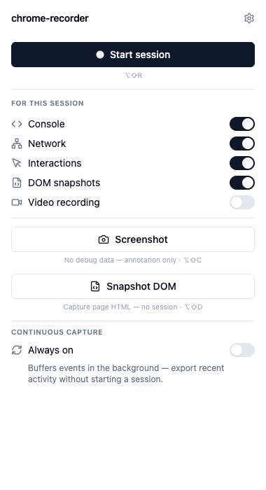
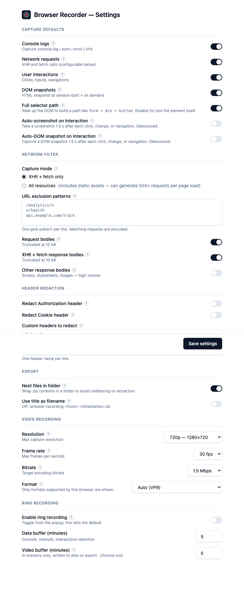
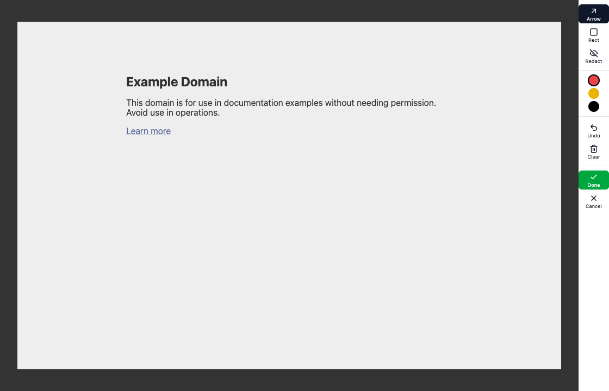
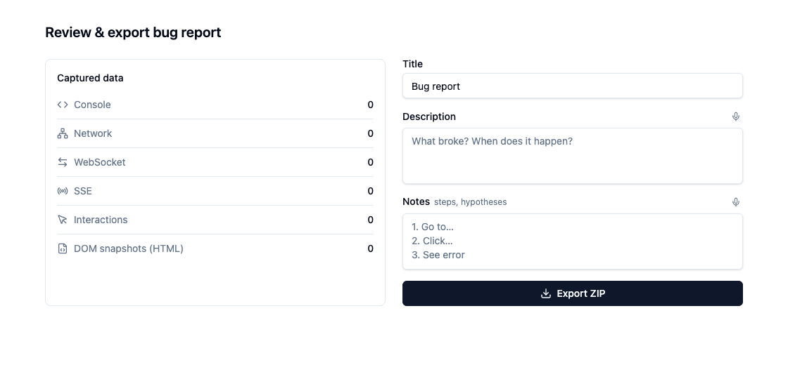

# Guide

## Installation

Download the browser-specific zip from [GitHub Releases](https://github.com/HabitatHQ/browser-recorder/releases), then extract it.

### Chrome

1. Open `chrome://extensions`.
2. Enable **Developer mode**.
3. Click **Load unpacked** and select the extracted `browser-recorder-<version>-chrome` folder.

### Firefox 128+

1. Open `about:debugging#/runtime/this-firefox`.
2. Click **Load Temporary Add-on** and select `manifest.json` from the extracted `browser-recorder-<version>-firefox` folder.

> Firefox temporary add-ons are removed when Firefox restarts. Firefox supports video for an explicit session through a dedicated capture tab and browser picker; it does not support continuous-capture ring video. Pin the extension icon for quick access.

## Usage

### Start, pause, stop, or discard a session

Open the popup and click **Start session** (or press **Alt+Shift+R**). Choose the session channels in the popup or configure defaults in **Options**. During capture, the popup has explicit **Pause**, **Resume**, **Stop & report**, and **Discard session** buttons. Stop opens the review page; discard removes the active session's captured data. Screenshots and DOM snapshots can be taken during a session and included in its report.

A paused session stops its page-event capture. Continuous capture is suspended for the entire explicit session, including while that session is paused. On Firefox, the separate picker-mediated video stream is not controlled by the popup's pause/resume buttons; stop or discard the session to end that video capture.

### Capture channels and settings

The popup has per-session switches for **Console**, **Network**, **Interactions**, **DOM snapshots**, **Video recording**, and experimental **Session replay**. Detailed settings are in the extension **Options** page (`chrome://extensions` → Browser Recorder → Extension options). Network captures XHR/fetch plus WebSocket and SSE; those latter two are grouped with Network, not independently toggled. Network body capture, response-body capture, URL exclusions, and custom header redaction are configured in Options and take effect for subsequent capture. Credential-like headers are omitted and recognised sensitive URL/body values are automatically redacted during capture; this does not guarantee that every secret is found or that other artifacts are safe.

| Channel | What it records |
|---|---|
| Console | Page JavaScript `console.log/warn/error/info/debug` calls and uncaught errors; not browser-native DevTools messages |
| Network | XHR/fetch requests and responses; body collection and exclusions configurable in Options |
| WebSocket and SSE | Lifecycle and message events, grouped under Network |
| Interactions | Clicks, input changes, navigations, and element metadata; entered text is not captured as raw text |
| DOM snapshots | Page HTML at session start (when enabled) and on demand |
| Screenshots | Captures on demand; optionally auto-captured after interactions in Options; annotate/redact in the editor |
| Video | Optional session video; configurable resolution (720p default), frame rate (30 fps), bitrate (1.5 Mbps), and format (auto) in Options |
| Session replay | DOM session replay, marked experimental; best-effort masking of native input values and contenteditable text before events leave the page; cross-origin styles/canvas may render imperfectly |
| Performance | Optional beta metrics; also available to continuous capture when enabled |

Chrome video settings offer 720p, 1080p, or native resolution; 15, 24, 30, or 60 fps; 500 kbps through 4 Mbps; and browser-supported auto/VP9/VP8/AV1/H.264 formats. 720p/30 fps/1.5 Mbps/auto are defaults, not fixed limits. Chrome warns at 100 MB and stops that recording at 500 MB; size depends on chosen settings and content. Video is written to local OPFS and can be downloaded separately from report review. Firefox's picker-mediated session video has its own browser controls and does not use the Chrome encoder settings.

### Session replay input masking

Session replay masking applies to native text inputs, textareas, selects, and
contenteditable elements other than `contenteditable="false"`. It is best effort,
not a promise that replay is safe to share: checkbox/radio values, select option
labels, custom widgets, ordinary page text/attributes, and other unmasked content
may remain. This replay-only masking does not redact static DOM snapshots,
screenshots, video, or other capture channels, and it does not change recordings
made before masking was added.

Masking happens during capture; it does not alter the page's live form values.

Screenshot and DOM shortcut/actions also work without a session. A standalone screenshot opens its own annotation/review page; a standalone DOM snapshot opens its own review page for an HTML download. These files are not retroactively attached to a later session.

### Continuous capture (Always on)

In the popup, **Continuous capture → Always on** controls a rolling background buffer. Its default is off and its default retention windows are 5 minutes for data and video. Continuous data includes console, network (including WebSocket/SSE), interactions, and optional performance; it does not include session replay, standalone screenshots/DOM snapshots, or Firefox video. New events are collected from the focused eligible tab. Up to eight tabs' recent data can be retained as you switch; only the focused tab is actively captured, and continuous video follows that active tab rather than being retained with switched-away tab histories.

Configure **Options → Ring recording** to set retention windows and scope:

- **Allowlist (default):** record only listed hostname patterns or currently pinned hosts. An empty allowlist records nothing by itself; when you enable Always on with an empty list, the focused host is automatically pinned so capture can begin.
- **Blocklist:** record sites except listed blocked host patterns.
- **All sites:** record all eligible sites.

The blocked-domain list wins over scope and pins in every mode. Browser-internal and extension pages are never recorded. From the popup's tab list, pin/unpin specific hosts; a pin lets a host outside the allowlist be recorded, but does not bypass a blocked-domain rule. Pins last only for the current browser session and are cleared on browser restart. Turning Always on off clears its buffered data. Click **Export** to snapshot retained data and open it in the report review page.

Starting any explicit session suspends **all** continuous capture, not only video. After the session stops or is discarded, the buffer resumes on the focused in-scope tab if still enabled. On a browser restart, retained ring event data may be restored from local OPFS, but video is memory-only and lost; restored data may remain exportable even though it cannot reattach to tabs whose IDs changed.

Recovery is best effort, not a guarantee: session events, screenshots, DOM
snapshots, replay, and session video are written to OPFS, while session state and
recent extension errors use browser storage. Browser storage may be unavailable and
writes may fail, so recovered session artifacts may be incomplete or unavailable.
Continuous-capture video is memory-only and is lost on restart.

### Review and privacy

Review is the point to decide what to share, not a guarantee that an artifact is safe. Capture-time handling omits credential-like headers and automatically redacts recognised sensitive values in supported URL/body fields. In **Network privacy**, the export review flags possible secrets and lets you opt in to redact selected detected fields; unchecked values remain. Choosing to remove a request removes the complete request, including URL and fields, from the report artifacts—no dropped-request placeholder is exported. **Include in export** lets you omit available large artifacts such as video. Inspect the exported ZIP before sharing: DOM, screenshots, video, replay, metadata, and unrecognised sensitive values may expose page or user information.

### Replaying a request

The report review's **Network privacy** rows offer replay and curl actions. Replay sends the edited request from the captured page using its live cookie jar (`credentials: "include"`). It can repeat state-changing operations and leave application/server traces; confirm the target and method/body before sending. Cross-origin requests remain subject to CORS. If page capture hooks are active, they may record the replay request and response; the replay UI does not directly add its response to the report. Curl output omits credential-like headers and may have truncated bodies, so treat it as a scaffold.

### Exporting

Review the title, description, notes, network decisions, and artifact selections, then click **Export ZIP**. By default, the filename is `browser-recording-{title-or-host}-{YYYYMMDD-HHmm}.zip`: title is preferred unless it is the default “Bug report,” then the captured host is used. Options can instead make the filename title-based. Standalone single screenshots and DOM snapshots download as `.png` or `.html`; other exports are ZIPs.

Every ZIP includes `README.md`, `report.md`, `report.html`, and `metadata.json`. Other files depend on captured events and review selections:

- `events.json` when there are timeline events; `console.json`, `network.json`, and `interactions.json` when their selected channels have events. WebSocket and SSE events are represented within `network.json`/the merged timeline, not separate per-protocol files.
- `performance.json` when performance data exists.
- `screenshot-N.png` and `dom-snapshot-N.html` when selected screenshots and DOM snapshots are available.
- `video.webm` or `video.mp4` when video is available and included; supported format and browser determine the container. You can instead download video separately.
- `replay.html` and `replay.json` when experimental session replay data exists.
- `_browser_recorder_self_diagnostics.json` when diagnostics are available.

No capture is uploaded by the extension. You control where exported files go and what you share.

### Experimental features and limitations

Session replay is off by default and can imperfectly render cross-origin
styles/canvas. Its [input masking](#session-replay-input-masking) is best effort,
not comprehensive redaction. Performance metrics are beta and metric fidelity is
still being validated. The side-panel/Firefox sidebar surface is experimental.
Request replay is a separate active network operation, not a safe preview.
Capture-time redaction is limited to recognised patterns and supported network
fields; review all artifacts before sharing.

### Keyboard shortcuts

| Shortcut | Action |
|---|---|
| Alt+Shift+R | Start session |
| Alt+Shift+S | Stop session and open report |
| Alt+Shift+C | Capture standalone screenshot or add one to a session |
| Alt+Shift+D | Capture standalone DOM snapshot or add one to a session |

Change shortcuts at `chrome://extensions/shortcuts`.

### Console capture

Console capture is not limited to events after **Start session**: while Continuous capture is enabled and a page is in scope, page JavaScript console output can enter the ring buffer before a session starts. An explicit session captures enabled console calls during its active recording. Browser-native DevTools messages (such as `ERR_BLOCKED_BY_CLIENT`, preload warnings, or browser-injected deprecation notices) do not pass through the page's JavaScript console API and are not captured as console events. For those, use the browser's DevTools console.
