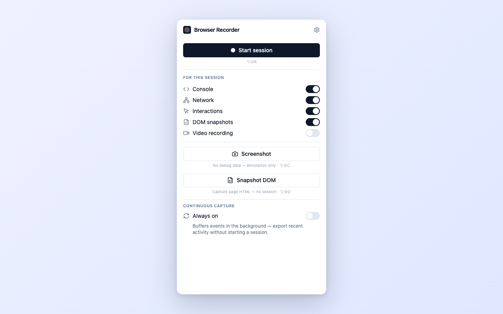

# Browser Recorder

A browser extension (Chrome + Firefox) that captures everything you need to file a bug report — console, network, interactions, DOM, screenshots, and optional video — and bundles it into a self-contained `.zip` you can hand to a teammate or paste into an issue.

No server, no account, no cloud.

   

## What you get

A single `.zip` per capture, named `browser-recording-{title}-{date}.zip`, containing a self-contained `report.html` viewer you can open in any browser. It includes:

- **Console** — `log`/`warn`/`error`/`info`/`debug` from page JS, plus uncaught errors
- **Network** — every XHR/fetch request and response (headers + body)
- **WebSocket & SSE** — lifecycle and message frames (payloads truncated to 4 kB)
- **Interactions** — clicks, inputs, navigations with element metadata
- **DOM snapshots** — serialised HTML with inlined same-origin styles
- **Screenshots** — manual captures with an annotation canvas (arrow, rectangle, blur)
- **Video** — tab recording via MediaRecorder (Chrome only)
- **Ring buffer** — always-on background capture so you can export what *just happened* even if you didn't start a session

Before exporting, the report tab also lets you redact or drop sensitive network entries and uncheck large artifacts (e.g. video) to keep the zip small.

## Install

Grab the latest `chrome-*.zip` from [Releases](../../releases), extract it, then load the folder as an unpacked extension:

- **Chrome:** `chrome://extensions` → enable *Developer mode* → *Load unpacked* → pick the extracted folder.
- **Firefox:** `about:debugging#/runtime/this-firefox` → *Load Temporary Add-on* → pick `manifest.json` inside the folder.

Pin the icon for quick access. Full step-by-step (including Firefox quirks and keyboard shortcuts) is in [GUIDE.md](GUIDE.md).

## Quick start

1. Click the extension icon (or press **Alt+Shift+R**). The icon badge turns red.
2. Reproduce the bug — click around, do the things.
3. Click the icon again (or **Alt+Shift+S**). The report tab opens.
4. Edit the pre-filled reproduction notes, redact anything sensitive, and click **Export ZIP**.

For "I didn't start a session but something just went wrong" — toggle **Ring recording** in the popup. It keeps the last 5 minutes in the background; click **Export ring** when you need it.

## CLI

A Node CLI is included for scripted repros and CI. It captures the same data via Playwright and exports a (slightly slimmer) zip. See [cli/README.md](cli/README.md).

## Contributing / building from source

See [DEVELOPMENT.md](DEVELOPMENT.md) for the dev workflow, scripts, screenshot generation, and the release process.

## Publishing (maintainers)

See [PUBLISH.md](PUBLISH.md) for the Chrome Web Store build, upload, and listing workflow.

## Status

Pre-1.0 — feature set and APIs are still settling. See [TODOS.md](TODOS.md) for what's in flight.

## License

[AGPL-3.0](LICENSE).

This project includes code adapted from [crikket](https://github.com/redpangilinan/crikket) by [redpangilinan](https://github.com/redpangilinan), also AGPL-3.0. That license applies to the whole project as a result.

## Third-party

- [WXT](https://wxt.dev), [React](https://react.dev), [Tailwind CSS](https://tailwindcss.com), [rrweb](https://github.com/rrweb-io/rrweb), [fflate](https://github.com/101arrowz/fflate), [Playwright](https://playwright.dev), [Biome](https://biomejs.dev). Full list and versions in [DEVELOPMENT.md](DEVELOPMENT.md#stack).
