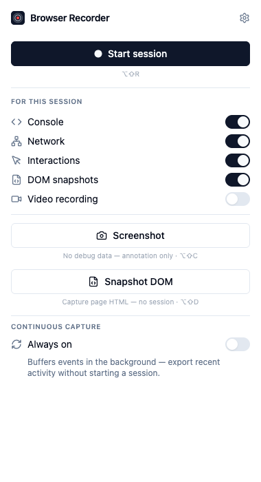
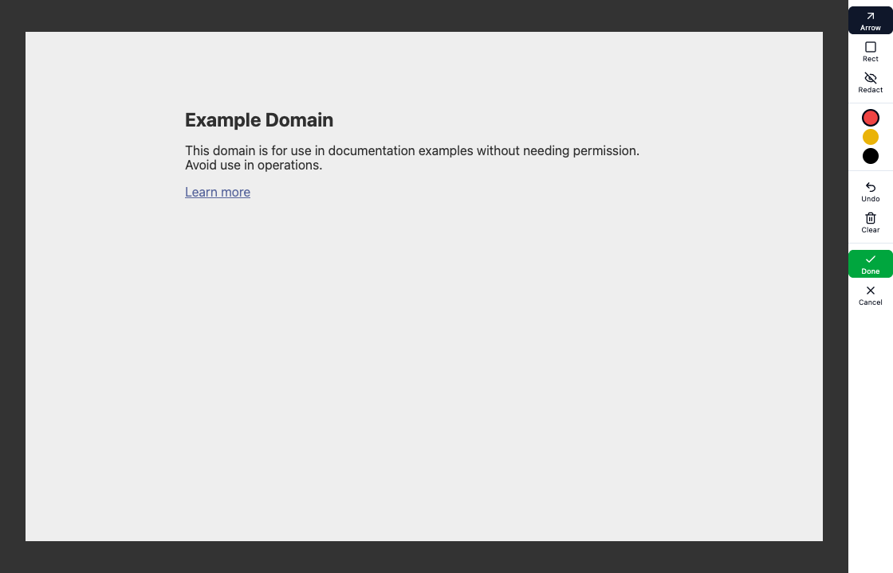
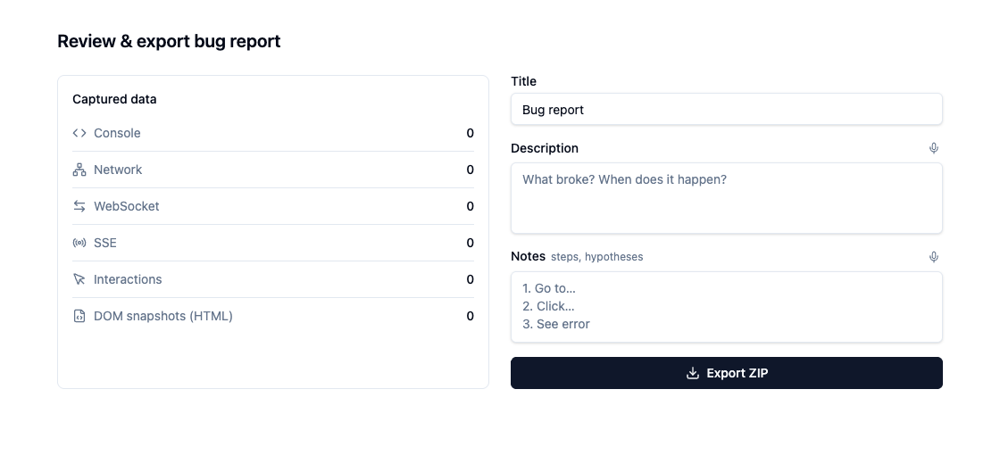
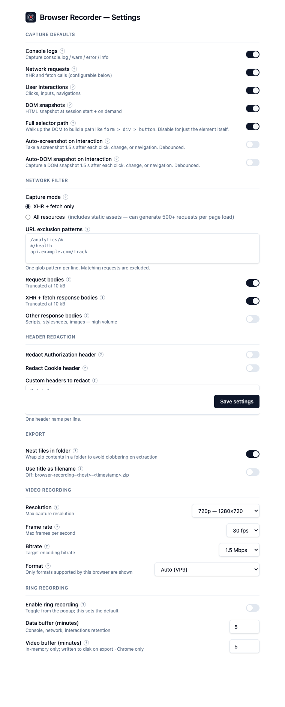

# chrome-recorder

A browser extension (Chrome + Firefox) for capturing debug data and exporting self-contained browser recordings. No server, no account, no cloud.

Captures console logs, network requests, interactions, DOM snapshots, screenshots, and optional video — all bundled into a local ZIP. Includes an always-on **ring buffer** that keeps the last N minutes in the background, so you can capture what just happened without having started a session first.

Download the latest release from [Releases](../../releases). See [GUIDE.md](GUIDE.md) for installation and usage.

## Screenshots

| Popup | Annotate |
|---|---|
|  |  |

Review &amp; export:



Settings:



Screenshots are generated from the built extension with `pnpm screenshots` (see [`scripts/capture-screenshots.mjs`](scripts/capture-screenshots.mjs)), which writes both these README crops to `docs/screenshots/` and 1280×800 store-listing images to `docs/store/`.

## Development

```sh
pnpm install
pnpm dev        # Chrome (hot-reload via WXT)
pnpm build      # Chrome MV3 (unpacked)
pnpm package    # build + zip for distribution
pnpm check      # TypeScript
```

To install: load `.output/chrome-mv3/` as an unpacked extension in `chrome://extensions`. See [GUIDE.md](GUIDE.md#installation) for details.

## Publishing to the Chrome Web Store

The package upload is scripted; the store **listing** (screenshots, descriptions, promo images) is not — those live only in the dashboard (see below).

```sh
pnpm build:cws          # build .output/<name>-<version>-chrome-cws.zip (manifest key stripped)
pnpm publish:chrome     # upload as a draft
pnpm publish:chrome --publish   # upload and submit for review
```

One-time setup:

1. Register a [Chrome Web Store developer account](https://chrome.google.com/webstore/devconsole) and upload the first version **manually** (the API can only update an existing item). Note the **extension ID**.
2. In [Google Cloud Console](https://console.cloud.google.com): create a project, enable the **Chrome Web Store API**, and create an **OAuth 2.0 Desktop client** (client ID + secret).
3. Mint a refresh token once (e.g. `npx chrome-webstore-upload-keys`).
4. `cp .env.publish.example .env.publish` and fill in the four `CWS_*` values. `.env.publish` is gitignored.

Why a separate build: the `key` in `wxt.config.ts` pins a stable extension ID for local unpacked loads, but the store assigns its own key — a baked-in `key` makes uploads fail. `build:cws` sets `CWS_BUILD=1` to strip it.

### What's in the upload vs. the dashboard

The uploaded zip contains **only the extension code + manifest**. The Chrome Web Store API (`upload`/`publish`) handles the package and publish state — **nothing else**. There is no public API for listing assets, so these are managed by hand in the Developer Dashboard:

- **Detailed description** — separate from the manifest `description`; edited in the dashboard.
- **Screenshots** — 1–5 images, **1280×800** or 640×400 PNG/JPEG. `pnpm screenshots` writes store-ready 1280×800 versions to `docs/store/` (drag them into the dashboard); the `docs/screenshots/` PNGs are the tighter README crops.
- **Promo tiles** — small 440×280, optional marquee 1400×560.
- **Store icon** — the 128×128 icon from the manifest is reused.
- **Category, language, privacy policy URL** — dashboard fields.

So: code ships through `publish:chrome`; copy and imagery are a manual dashboard step that only changes when you want to refresh the listing.

## Known gaps / TODO

- **Crash resilience** — console, network, screenshots, and DOM snapshots live in `chrome.storage.session`; a browser crash silently wipes them. Video is the only artifact streamed to OPFS. All session data should be persisted to OPFS so a mid-session crash is recoverable.
- **Local report history** — once a ZIP is exported it's gone from the extension. There is no way to reopen, search, or annotate past reports. A persistent local store (IndexedDB or OPFS) indexed by session would make this a genuinely local-first tool rather than a one-shot exporter.
- **Self-contained report viewer** — the ZIP is readable if you unzip it, but there is no viewer. Bundling a single-file `report.html` inside the ZIP (no server, opens in browser) would make exports useful to non-developers.
- **WebSocket binary frames** — binary payloads are captured as size annotations (`[Binary: N bytes]`) rather than decoded content.

Not planned (noted for completeness): localStorage / sessionStorage snapshot.

## Attribution

The capture engine in `src/vendor/capture-core/` is adapted from [crikket](https://github.com/redpangilinan/crikket) by [redpangilinan](https://github.com/redpangilinan).

## License

[AGPL-3.0](LICENSE). The vendored capture engine from crikket is also AGPL-3.0, which is why this license applies to the whole project.

## Stack

- [WXT](https://wxt.dev) — extension framework (Chrome MV3 + Firefox MV3)
- [React 19](https://react.dev) + TypeScript
- [Tailwind CSS v4](https://tailwindcss.com)
- [fflate](https://github.com/101arrowz/fflate) — in-browser ZIP
- [Biome](https://biomejs.dev) — linting
