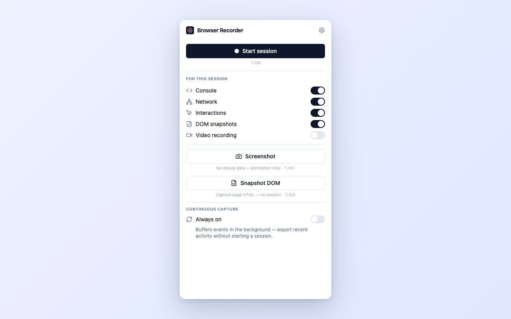

# Browser Recorder

A browser extension for Chrome and Firefox that captures the evidence needed for a bug report—console output, network activity, interactions, DOM snapshots, screenshots, and optional video—and bundles it into a portable `.zip`.

Browser Recorder has no account, telemetry, or upload service. Captures use browser-managed local storage; exports are files under your control. Exported files can contain sensitive page data, and **request replay sends a real, potentially authenticated request**, so review both features before use or sharing.

   

## What you get

A session export is named `browser-recording-{title-or-host}-{YYYYMMDD-HHmm}.zip` by default. It contains a self-contained `report.html` viewer plus the selected artifacts that were actually captured:

- **Console**—`log`/`warn`/`error`/`info`/`debug` from page JavaScript, plus uncaught errors
- **Network**—XHR/fetch requests and responses, with WebSocket and SSE activity grouped under the Network channel
- **Interactions**—clicks, inputs, and navigations with element metadata
- **DOM snapshots**—serialised HTML with inlined same-origin styles
- **Screenshots**—manual or optional interaction-triggered captures with an annotation canvas
- **Video**—Chrome session and continuous-capture video; Firefox explicit-session video through a dedicated capture tab and browser picker
- **Continuous capture**—a scoped rolling buffer for recent console, network (including WebSocket/SSE), interaction, and optional performance activity; Chrome can also retain rolling video
- **Session replay**—experimental page replay with best-effort masking of native input values and editable text before replay events leave the page

Capture-time filtering automatically removes credential-like headers and redacts recognised sensitive URL/body fields. The report tab adds an optional second review where you can redact detected fields, remove an entire request from every report artifact, or exclude large artifacts. Automated checks do not make screenshots, DOM, video, replay, or other captured content safe to share.

### Request replay

From **Network privacy**, you can edit a captured request's method, URL, headers, or body and resend it from the still-open page. This is an active operation: it uses the page's live cookies (`credentials: "include"`), can trigger side effects, is subject to CORS, and may leave normal server-side traces. If page capture hooks are active, they may also record the replay request and response. The replay response is not directly added to the report by the replay UI.

Every request also has a **curl** button in the review and exported report. Captured credential headers are omitted and long bodies are truncated, so the command is a scaffold to inspect and complete, not a turnkey authenticated command.

## Install

Download the browser-specific asset from [GitHub Releases](https://github.com/HabitatHQ/browser-recorder/releases):

- **Chrome:** `browser-recorder-<version>-chrome.zip` → extract it → open `chrome://extensions` → enable **Developer mode** → **Load unpacked** → select the extracted folder.
- **Firefox 128+:** `browser-recorder-<version>-firefox.zip` → extract it → open `about:debugging#/runtime/this-firefox` → **Load Temporary Add-on** → select the extracted `manifest.json`.

Firefox temporary add-ons are removed when Firefox restarts. Pin the extension icon for quick access. Full setup and browser-specific capture details are in [GUIDE.md](GUIDE.md).

## Quick start

1. Open the extension popup and click **Start session** (or press **Alt+Shift+R**).
2. Reproduce the bug. The popup offers **Pause**/**Resume**, session screenshots and DOM snapshots, and **Discard session**.
3. Open the popup and click **Stop & report** (or press **Alt+Shift+S**).
4. Edit the report, review sensitive data and included artifacts, then click **Export ZIP**.

For unplanned problems, turn on **Continuous capture → Always on**. The default rolling data window is five minutes, but capture is restricted by the configured site scope. If the default allowlist is empty, enabling it pins the focused host for the current browser session. Click **Export** to review the retained window. Starting an explicit session suspends all continuous capture until that session stops or is discarded.

## CLI

A separate Node CLI is included for scripted reproductions and CI. It uses Playwright and has a smaller, different artifact and privacy surface than the extension: it does not provide the extension's report viewer, merged timeline, or video capture. See [cli/README.md](cli/README.md).

## Contributing / building from source

See [DEVELOPMENT.md](DEVELOPMENT.md) for the development workflow, scripts, screenshot generation, and release process.

## Publishing (maintainers)

See [PUBLISH.md](PUBLISH.md) for Chrome Web Store packaging, upload, and listing details.

## Status

Pre-1.0—behavior and exported formats may still change. See [TODOS.md](TODOS.md) for known gaps.

## License

[AGPL-3.0](LICENSE).

This project includes code adapted from [crikket](https://github.com/redpangilinan/crikket) by [redpangilinan](https://github.com/redpangilinan), also AGPL-3.0. That license applies to the whole project as a result.

## Third-party

- [WXT](https://wxt.dev), [React](https://react.dev), [Tailwind CSS](https://tailwindcss.com), [rrweb](https://github.com/rrweb-io/rrweb), [fflate](https://github.com/101arrowz/fflate), [Playwright](https://playwright.dev), [Biome](https://biomejs.dev). Full list and versions in [DEVELOPMENT.md](DEVELOPMENT.md#stack).
